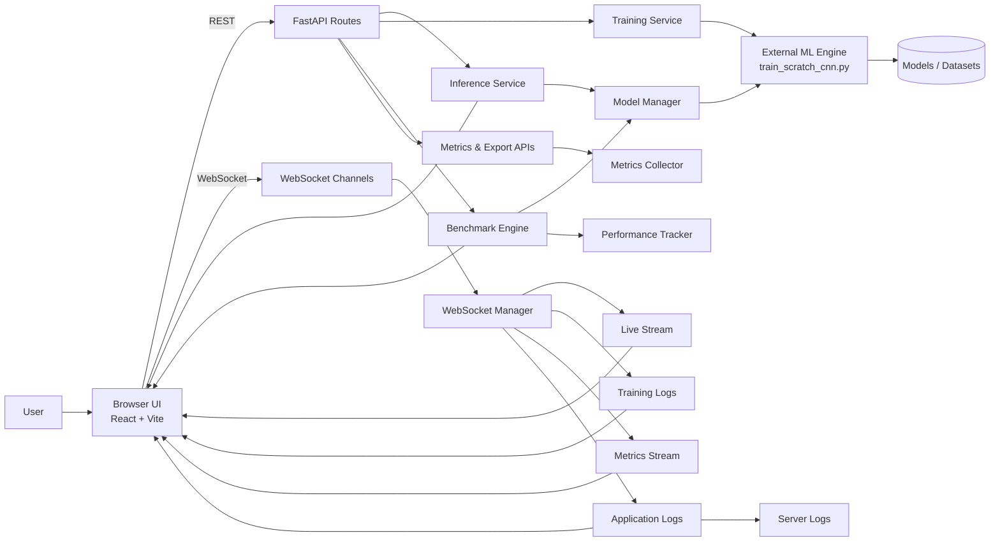
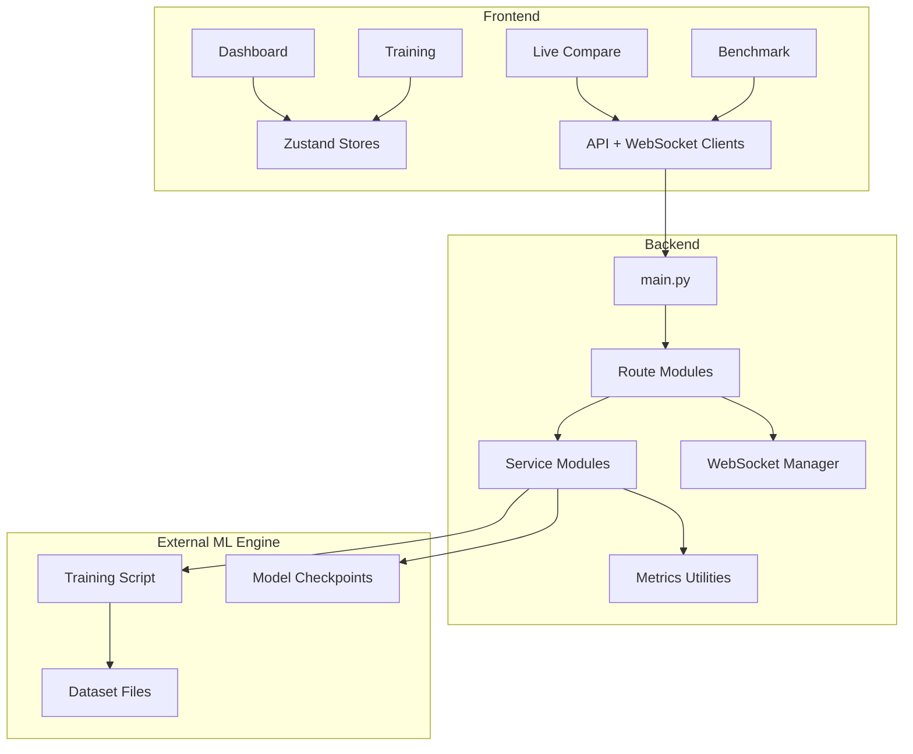

# System Architecture

## Overview

This project is a full-stack ML evaluation dashboard for face-detection workflows. The system is split into four main layers:

1. Frontend UI for monitoring, training, benchmarking, and live comparison.
2. FastAPI backend that exposes REST and WebSocket endpoints.
3. Service layer that handles inference, training, benchmarking, logging, and metrics.
4. ML engine integration that runs the real training and inference workload.

The design is centered on real-time communication. REST is used for one-shot actions such as starting jobs and fetching reports, while WebSocket channels stream live frames, metrics, logs, and training progress.

## System Architecture

### Frontend Layer

- React 18 application built with Vite and TypeScript.
- Pages for Dashboard, Training, Live Compare, and Benchmark.
- Zustand stores for shared state such as active model, system metrics, and training jobs.
- Axios for REST calls and native WebSocket clients for streaming updates.

### Backend Layer

- FastAPI application with lifecycle management in `main.py`.
- Route modules for inference, training, benchmark, metrics, export, internal, and live streaming.
- WebSocket manager for channel-based broadcasts.
- CORS and health/status endpoints for operational visibility.

### Service Layer

- `ModelManager` loads and activates models.
- `InferenceService` prepares frames and runs inference.
- `TrainingService` launches the external training script and streams logs.
- `BenchmarkEngine` runs latency and full-evaluation benchmarks.
- `MetricsCollector` and `PerformanceTracker` keep runtime and historical metrics.
- `LogStreamer` forwards application logs to connected clients.

### ML Engine Layer

- Real model training is executed through the external `train_scratch_cnn.py` script.
- Model checkpoints and datasets are read from the ML engine workspace.
- The backend treats the ML engine as the source of truth for training and inference execution.

## Block Diagram

## Internal Block View

## Data Paths

- Browser to backend: HTTP requests for job control, model activation, and exports.
- Browser to backend: WebSocket frames for live webcam streaming and streamed results.
- Backend to ML engine: subprocess execution for training and model evaluation.
- Backend to frontend: live metrics, logs, training progress, and benchmark progress.

## Why This Structure Works

- It keeps the UI responsive because long-running work is pushed into background services.
- It separates real-time streams from request/response APIs.
- It isolates ML execution in the external engine so the dashboard stays thin and stable.
- It makes the system easy to extend with new models, metrics, and benchmark modes.
